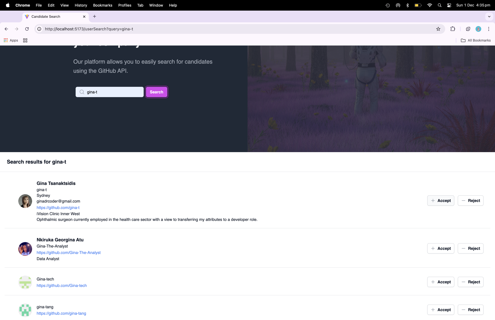

# candidate-search-spa

A candidate search application that calls the GitHub API and renders data in the browser.

## Table of Contents

- [Description](#description)
- [Installation](#installation)
- [Usage](#usage)
- [License](#license)
- [Contributing Guidelines](#contributing-guidelines)
- [Testing](#testing)
- [Authors and Acknowledgements](#authors-and-acknowledgements)


## Description

A single page app of a candidate search/save using React + Vite + Tailwind CSS + Typescript.

## Installation

1. Clone the repository:

```zsh

git clone git@github.com:gina-t/candidate-search-spa.git

```

2. Install dependencies:

```zsh

npm install

```

3. Generate a fine-grained personal access token for your GitHub account

4. Install additional dependencies:


```zsh

npm npm install @vitejs/plugin-react eslint-plugin-react @typescript-eslint/eslint-plugin @typescript-eslint/parser react-router-dom 

```

5. Install and initialise Tailwind CSS:

```zsh

npm install -D tailwindcss postcss autoprefixer
 
npx tailwindcss init -p

```
6. Configure template paths in tailwind.config.js:
  
  export default {
    content: [
      "./index.html",
      "./src/**/*.{js,ts,jsx,tsx}",
    ],
    theme: {
      extend: {},
    },
    plugins: [],
  }

7. Add the @tailwind directives to index.css:

  @tailwind base;
  @tailwind components;
  @tailwind utilities;

8. Start the development server:

```zsh

npm run dev

```

9. Install serve package to ready for deployment:

```zsh

npm install --save serve

```

10. Add the serve script to the scripts section of package.json:
{
  "name": "13-challenge",
  "private": true,
  "version": "0.0.0",
  "type": "module",
  "scripts": {
    "dev": "vite",
    "build": "tsc && vite build",
    "lint": "eslint . --ext ts,tsx --report-unused-disable-directives --max-warnings 0",
    "preview": "vite preview",
    "serve": "serve -s dist" // Added serve script
  }
}

11. Build the application:

```zsh

npm run build

```

12. Serve the production build:

```zsh

npm run serve

```

## Usage

Screenshots of the app demonstrating functionality:

### Screenshot 1


### Screenshot 2


### Screenshot 3


### Screenshot 4


### Screenshot 5


## License

[](https://opensource.org/licenses/MIT)

## Contributing Guidelines

Create a new branch for the commit and start a pull request.

## Testing


## Authors and Acknowledgements

[email] (ginadrcoder@gmail.com)


## Questions

For enquiries, please contact me at:

[email] (ginadrcoder@gmail.com)
[github] (https://github.com/gina-t)

